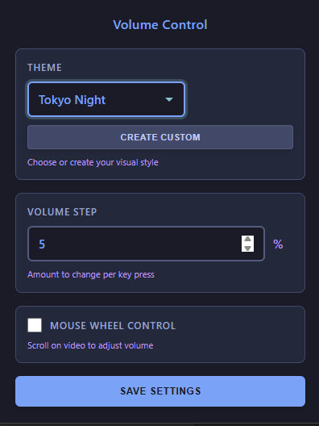
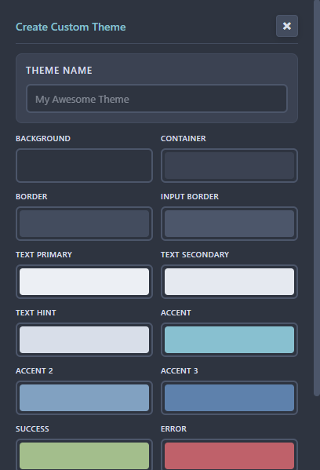
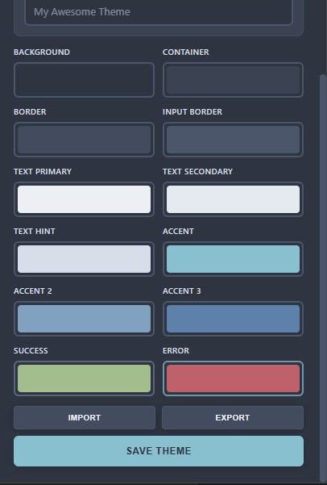

# YouTube Volume Control Enhanced 🎧

> The ultimate customizable volume controller for YouTube. Themes, scroll gestures, and granular control.

## ✨ Features

*   **🖱️ Scroll to Control:** Adjust volume by scrolling your mouse wheel over the video player.
*   **🎨 Theme Engine:** 
    *   Built-in presets: **Nord**, **Dracula**, **Tokyo Night**, **Catppuccin**.
    *   **Theme Builder:** Create, edit, import, and export your own custom color schemes.
*   **🎹 Granular Precision:** Set your custom volume step size (e.g., 1%, 5%, 10%).
*   **👀 Visual Feedback:** Beautiful, non-intrusive on-screen display (OSD) for volume changes.
*   **⌨️ Keyboard Shortcuts:** Enhanced Arrow Up/Down control that respects your custom step size.

## 📸 Gallery

| Theme Editor | Custom Settings |
|:---:|:---:|
|  |  |

## 📥 Installation

### From Source (Developer Mode)
1.  Download or clone this repository.
2.  Open Chrome/Brave/Edge and go to `chrome://extensions/`.
3.  Toggle **Developer mode** in the top right.
4.  Click **Load unpacked**.
5.  Select the folder containing this repository.

## 🛠️ Usage

1.  **Click the extension icon** to open the control panel.
2.  **Select a Theme** to match your browser setup.
3.  **Enable Scroll Control** to change volume with your mouse wheel.
4.  **Set Step Size** to define how fast the volume changes (default is 5%).

### Creating Custom Themes
1.  Open the popup and click **"Create New"**.
2.  Adjust colors for background, foreground, and accents using the live preview.
3.  Click **Save**. You can also **Export** your theme to share it!

## 🔧 Technical

*   **Manifest V3** compliant.
*   **Permissions:** `storage` (for settings), `activeTab` (for injecting the controller).
*   **Privacy:** No data collection. All settings stored locally in your browser.

## 📄 License

MIT License
